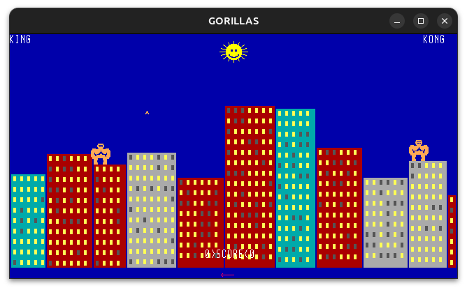

# Gorillas

Because someone had to do it: [QBasic Gorillas](https://en.wikipedia.org/wiki/Gorillas_(video_game)), the 1991 IBM classic where two gorillas fling exploding bananas across a city skyline, reimplemented in Rust, on wgpu, with synthesized audio.



The original [`GORILLAS.BAS`](GORILLAS.BAS) is bundled in this repo. The source material is, shall we say, vintage. The render pipeline is not.

## How it works

Two players take turns entering throw angle and velocity. Wind, gravity, and the city skyline stand between your banana and the other gorilla's face. First to score the agreed-upon number of hits wins. It's 200 lines of 1991 BASIC logic running on a GPU render loop and a waveform synthesizer.

## Tech Stack

- **Rust**, because we want _safe_ exploding bananas
- **wgpu** for GPU rendering
- **winit** for windowing
- **cpal** + **synthie** for audio

## Running

```sh
cargo run
```
